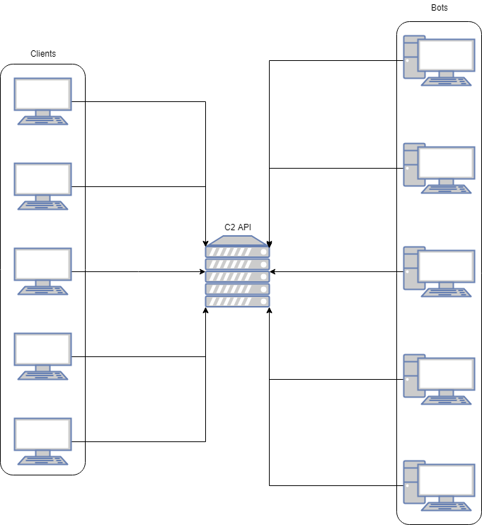

# Comando e Controle com Python e Flask - Uma implementação REST

## Descrição

Este é um servidor de comando e controle escrito em Python e que usa o microframework Flask. Ele funciona via chamadas de API via HTTPS. Todos os dados trafegados entre as partes estão estruturados com JSON.

A arquitetura na qual o C2 está inserido é simples e está conforme a imagem abaixo:




Como pode-se ver na imagem acima, clientes podem falar com o servidor para receber vários tipos de informação e para emitir comandos (requisições) para um ou mais bots ao mesmo tempo.

As requisições são armazenadas no servidor e ficam aguardando os bots fazerem check-in e perguntar se há tarefas para eles executarem. Uma vez que finalizem suas tarefas, eles chamam o servidor novamente para enviar os resultados. Os clientes podem monitorar o servidor e aguardar suas requisições serem completadas.

Além disso, todo o tráfego acontece via HTTPS, então para que o servidor execute apropriadamente, é necessário criar uma chave privada e certificado, com o comando a seguir:

 ```bash
openssl req -x509 -newkey rsa:4096 -nodes -out cert.pem -keyout key.pem -days 365
 ```

Após isto, podemos executar o servidor via HTTPS:

 ```python
app.run(host='0.0.0.0', port=443, ssl_context=('cert.pem','key.pem'))
 ```

Mais uma coisa importante sobre o servidor é que ele recebe e envia dados em formato JSON. Essa é a única forma de comunicação. Isso significa que, não importa em que linguagem os bots ou clientes são escritos, se eles também se comunicarem usando JSON, tudo funciona.

### Pré requisitos

- Python 3.7.x+
- Flask (pip install flask)

## Os bots

Os bots se comunicam com o servidor em períodos de tempo aleatórios: entre cinco e dez minutos os bots fazem uma requisição GET para o endpoint /Check. Eles também contactam o servidor quando possuem resultados para enviar.

Todo bot precisa gerar um id na primeira vez que ficam online. Esse id é armazenado para uso futuro dentro do C2 quando o bot se registra. Não importa como ele é criado, com tanto que seja único para a máquina.

## Os clients

Os clientes são qualquer coisa ou qualquer um que contactam o C2 para receber informações sobre os bots, requisições ou tarefas. Eles também podem emitir novas requisições para um ou mais bots.

## Requests e tasks

O C2 funciona agendando requisições emitidas pelos clientes. Cada requisição contém uma ou mais tarefas. Uma tarefa é associada com um bot, ou seja, quando o cliente emite uma requisição, ele precisa informar uma lista de alvos (bots) que irão executar a ação especificada pela requisição. Então o número de tarefas de uma requisição é igual ao número debots válidos e online na lista informada pelo cliente.

## Autenticação

O servidor usa o método _HTTP Basic Authentication_ para dar acesso aos clientes e bots. Todas as requisições enviadas ao C2 precisam conter o cabeçalho de autenticação, seguindo as diretivas do protocolo HTTP, ou seja, o valor do cabeçalho precisa ser *Basic base64-string*, onde "base64-string" é o nome de usuário e a senha no formato *username:password* e codificados em base64.

## A API

Basicamente, as chamadas de API são divididas em dois grupos: o que é usado pelos clientes e o que é usado pelos bots.

É importante notar que todas as respostas dadas pelo servidor estão em formato JSON. Ainda, toda informação que precisa ser passada ao servidor também precisa estar em JSON. Cada requisição HTTP POST precisa conter um JSON específico.

### Chamadas de API de cliente

#### /getOverview

Esta chamada retorna três informações: número total de bots, quantidade online e quantidade offline.

 ```json
{
    "numBots": 5,
    "online": 4,
    "offline": 1
}
 ```

**Método HTTP aceito: GET**

#### /getStatus/<bot_id>

Esta chamada precisa do id de um bot. Ela procura no banco de dados e retorna todas as informações sobre ele:

```json
{
    "bot_id": "bot_id_1",
    "last_check": "20190528143809",
    "online": "True",
    "hostname": "pc01",
    "ip_address": "10.10.10.10"
}
```

Mais informações sobre os bots podem ser armazenadas em melhorias futuras.

**Método HTTP aceito: GET**

#### /checkTask/<task_id>

Dado um id de tarefa, o C2 retorna um JSON contendo informações sobre ela:

```json
{
    "bot_id": "bot_id_1",
    "data": [
        "data-resulted-from-the-task",
        "more-data"
    ],
    "status": "done",
    "task_id": "d893519d-e1fe-4b0d-b3a0-4092f1ac089d"
}
```

Note que, se uma tarefa está completa, haverá mais um item no JSON: "data". Este campo contém os resultados dessa tarefa particular. Se a tarefa não está completa ainda, este campo não existe. Ainda, até que uma tarefa esteja completa, seu status será "not_done". Quando completa, o status será "done".

**Método HTTP aceito: GET**

#### /checkRequest/<request_id>

Dado o id de uma requisição, o C2 retorna um JSON contendo toda informação sobre ela e sobre as tarefas a ela associadas:

```json
{
    "arguments": {
        "cmd": "ifconfig /all"
    },
    "date": 20190501134855,
    "request_id": "0bd62b27-823d-44a1-a8b5-ff4bd429fab6",
    "request_type": "cmdexec",
    "status": "not_done",
    "targets": [
        "bot_id_1",
        "bot_id_2"
    ],
    "tasks": [
        {
            "bot_id": "bot_id_1",
            "status": "not_done",
            "task_id": "d893519d-e1fe-4b0d-b3a0-4092f1ac089d"
        },
        {
            "bot_id": "bot_id_2",
            "data": [
                "data3",
                "data4"
            ],
            "status": "done",
            "task_id": "53374745-92fc-4227-8556-2be684aa9c07"
        }
    ]
}
```

**Método HTTP aceito: GET**

#### /newRequest

Para fazer uma nova requisição, o cliente precisa passar um JSON ao C2 via POST para o endpoint "/newRequest". Esse JSON contém todas as informações que o C2 precisa para emitir a nova requisição para os alvos (bots).

```json
{
    "targets":["test_id_1","test_id_2"],
    "request_type":"cmdexec",
    "arguments":{"cmd":"ipconfig /all"}
}
```

Tipos de requisição atualmente aceitos: cmdexec, printscreen e keylog. Planos futuros para revshell, download, upload e search.

**Método HTTP aceito: POST**

Cada tipo de requisição necessida de argumentos específicos:

##### cmdexec

```json
    "arguments":{"cmd":"command"}
```

Substitua "command" com o comando a ser executado.

O resultado do comando deve ser entregue em JSON como a seguir:

```json
{
    "request_id":"id-of-the-request",
    "data":"base64-string"
}
```

##### printscreen

```json
"arguments":{"num_prints":num, "interval":num}
```

Substitua "num" com o número de prints desejado e o intervalo entre prints (em segundos).

O resultado dessa tarefa precisa ser entregue ao C2 no seguinte formato:

```json
{
    "request_id":"id-of-the-request",
    "bot_id":"id-of-the-bot",
    "request_type":"printscreen",
    "status":"<done|error>",
    "data":{
        "filename1":"base64-image1",
        "filename2":"base64-image2"
    }
}
```

##### keylog

```json
"arguments":{"cmd":"<start|dump|stop>"}
```

Veja que temos apenas três opções de comando para keylog. "start" para iniciar a captura de teclas, "dump" para enviar a coleta parcial, e mante-la ativa, e "stop" envia o que estiver em buffer e para a coleta.

O resultado deve ser enviado em JSON no seguinte formato:

```json
{
    "request_id":"id-of-the-request",
    "bot_id":"id-of-the-bot",
    "request_type":"keylog",
    "status":"done",
    "data":"base64-string"
}
```

##### download

```json
"arguments":{"file":"complete_path"}
```

Substitua "complete_path" pelo caminho completo do arquivo junto com seu nome. Use contrabarras duplas.

O retorno dessa tarefa precisa estar como a seguir:

```json
{
    "request_id":"id-of-the-request",
    "bot_id":"id-of-the-bot",
    "request_type":"download",
    "status":"done",
    "data":{
        "file":"base64-string-file"
    }
}
```

##### upload

```json
"arguments":{"source":"file_stream", "destination":"path+filename"}
```

Substitua "file_stream" com o arquivo que deseja realizar o upload. Precisa estar em codificado em base64. Substitua "path+filename" com o caminho de destino completo e nome do arquivo no destino. Use contrabarras duplas.

Já que o servidor precisa saber se o upload foi realizado com sucesso ou não, o resultado dessa tarefa precisa ser como a seguir:

```json
{
    "request_id":"id-of-the-request",
    "bot_id":"id-of-the-bot",
    "status":"<done|error>"
}
```

##### search

```json
"arguments":{"string":"term_to_be_searched", "base_dir":"path"}
```

Substitua "term_to_be_searched" com o termo que deseja procurar e "base_dir" com p caminho a ser usado como base para a busca.

O resultado da busca precisa ser enviado como a seguir:

```json
{
    "request_id":"id-of-the-request",
    "status":"<done|error>",
    "data":{
        "result1":"base64-string",
        "result2":"base64-string",
        "result3":"base64-string",
        "result4":"base64-string"
    }
}
```

### Chamadas de API dos Bots

#### /Check

Este endpoint é usado pelos bots para três coisas:

1 - Registrar um novo bot que acabou de se conectar ao C2 pela primeira vez;

2 - Receber um "alive sognal" de um bot já cadastrado;

3 - Verificar se existem tarefas agendada para o bot que acabou de fazer check-in.

##### First time registration

When registering with the server, the bot must send a JSON like the one bellow:

```json
{
    "bot_id":"bot_id_20",
    "version":"version",
    "hostname":"devicename",
    "ip":"0.0.0.0"
}
```

Depois de registrar o bot, o C2 responde com código de status HTTP 201:

```json
{
    "status": "registered"
}
```

##### Alive signal

Quando enviando o "alive signal", o bot apenas envia uma requisição HTTP GET para o endpoint /Check. O C2 irá atualizar seu status para "online" e o "last_check" para o timestamp atual, que está no formato yyyymmddhhmmss.

Depois de receber o "alive signal", o C2 irá verificar se existem tarefas agendadas para esse bot. Se não tiver nenhuma, sua resposta será:

```json
{
    "status": "updated"
}
```

**Método HTTP aceito: POST**

##### New tasks

Caso exista pelo menos uma nova tarefa para um bot, o C2 responde ao "alive signal" com o seguinte JSON:

```json
{
    "status": "new",
    "tasks": [
        {
            "bot_id":"id-of-the-bot",
            "arguments": {
                "cmd": "ifconfig /all"
            },
            "request_id": "4d7c392b-cc2c-414e-88e7-a46cb37445c3",
            "request_type": "cmdexec"
        }
    ]
}
```

#### /sendResult

Este endpoint é usado pelos bots quando eles precisam enviar ao C2 os resultados das tarefas executadas. O JSON enviado precisa ser no formato abaixo, que contém  as informações sobre o status da tarefa, ou seja, se foi completada com sucesso ou não. Além disso, se a tarefa foi executada com sucesso, o JSON da tarefa precisa conter o campo "data" com os resultados da tarefa: 

```json
{
    "task_id":"id-of-the-task",
    "bot_id":"id-of-the-bot",
    "request_type":"cmdexec",
    "status":"done",
    "data":"result-of-the-task"
}
```

**Método HTTP aceito: POST**

